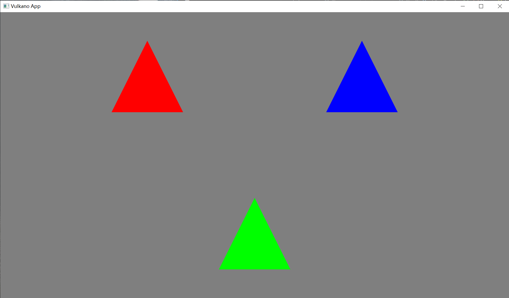
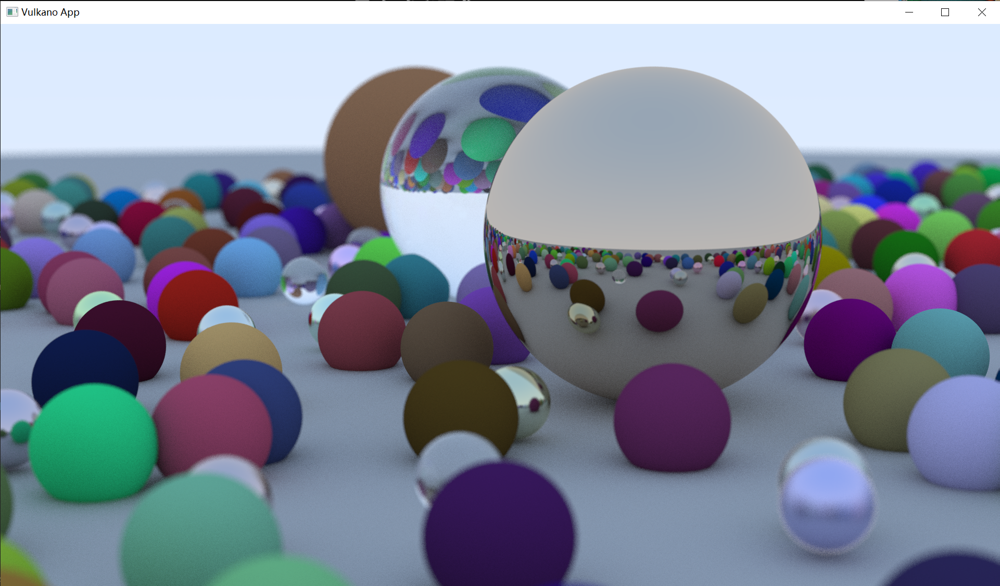

# vulkano-raytracing-demo

An example of KHR raytracing using [vulkano](https://github.com/vulkano-rs/vulkano) and [rust-gpu](https://github.com/EmbarkStudios/rust-gpu).

## Run desktop client

```
cargo run -p minimal -F desktop
```

## Build android app

```
rustup target add aarch64-linux-android
cargo install cargo-ndk
cargo ndk -t arm64-v8a -o android-project/app/src/main/jniLibs/ build -p minimal
cd android-project
./gradlew build
./gradlew installDebug
```

## Demos

### minimal



### weekend


